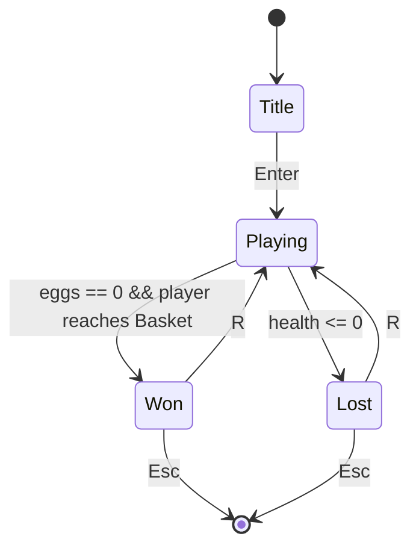
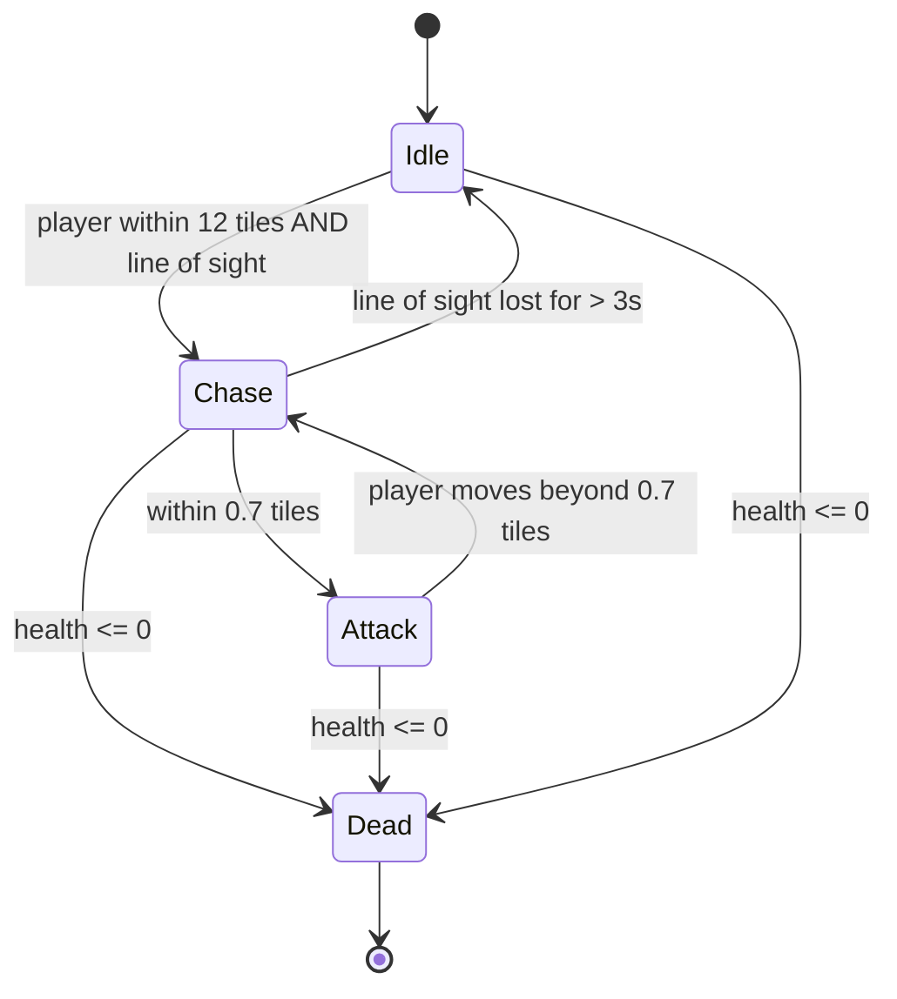

# EGG HUNT — MVP

The smallest thing that is a **complete, playable game**: you spawn, you fight, you can win, you can lose, and you can play again without relaunching. Derived from [`requirements.md`](./requirements.md) — this document covers **Phase 0 + Phase 1** only.

Everything here has concrete numbers so it can be built without further design decisions. Tuning values are starting points, not gospel — they exist so nobody has to invent them mid-build.

---

## 1. The game in one paragraph

You are the Easter Bunny, on foot, in a four-room burrow rendered by a hand-written raycaster. Five hostile Eggs are scattered through it. You have a Carrot Blaster. Crack all five eggs, then reach the Basket to win. If they corner you first, you lose. Press `R` to go again.

---

## 2. Definition of "playable"

The MVP ships when **all** of these are true:

- [ ] Launches from a double-clicked `.exe` on a machine with no dev tools installed
- [ ] Title screen → play → win *and* lose states → restart, with no relaunch needed
- [ ] Mouselook + WASD feel correct; mouse releases on `Esc` and on focus loss
- [ ] You cannot walk through walls, and you cannot get stuck on a corner
- [ ] All five eggs can be found, fought, and killed
- [ ] Eggs can kill you
- [ ] Both pickups work and are visibly needed
- [ ] Stable 60 fps in Release at 1080p windowed
- [ ] Runs for 10 minutes without crashing, leaking, or drifting out of sync
- [ ] `ctest` passes on Windows and Linux in CI

---

## 3. Game flow



`Playing` always restarts from a **freshly seeded initial state** — no partial resets. This falls out for free from the deterministic-state design and makes the restart path trivially correct.

---

## 4. Controls

| Input | Action |
|---|---|
| `W` / `S` | Move forward / back |
| `A` / `D` | Strafe left / right |
| Mouse X | Turn |
| `←` / `→` | Turn (keyboard fallback, for a machine with no mouse) |
| Left click / `Ctrl` | Fire |
| `Shift` | Sprint (×1.5 move speed) |
| `Esc` | Release mouse capture → second press quits |
| `R` | Restart (on Won/Lost screens) |
| `F1` | Toggle debug overlay (fps, tick, position, entity count) |

Mouse is captured on entering `Playing` and released on `Esc` or window focus loss. **Re-capture requires a click** — never silently steal the cursor back.

---

## 5. The level

One level, `burrow_01`, embedded as a string constant in the binary. 24×18 tiles. Validated as fully enclosed with all 248 open cells reachable from spawn.

```
########################
#.......####...........#
#.......####...E.....J.#
#..P...................#
#.......####...........#
#.....J.####.C......E..#
#.......####...........#
####.#############.#####
####.#############.#####
####.#############.#####
#.........####.........#
#.J.......####.........#
#.........####...E.....#
#.................X....#
#..E......####.........#
#.......C.####......E..#
#.........####.........#
########################
```

| Char | Meaning |
|---|---|
| `#` | Wall |
| `.` | Floor |
| `P` | Player spawn (faces east) |
| `E` | Cracked Egg spawn — 5 total |
| `J` | Jellybean pickup (ammo) — 3 total |
| `C` | Carrot pickup (health) — 2 total |
| `X` | The Basket (win trigger) |

**Layout:** four rooms — the Burrow (spawn, west), the Pantry (north-east), the Cellar (south-west), and the Basket room (south-east) — joined by three narrow corridors. The corridors matter: they create sightline breaks so eggs enter and leave your view, which is what makes a raycaster read as a *game* rather than a tech demo.

The map is **validated at startup**, not trusted. Rectangular, fully wall-enclosed, exactly one `P`, at least one `E`, exactly one `X`, and every open cell reachable from spawn. Failure aborts with a specific message naming the offending row/column — a malformed embedded map is a programmer error and should be loud.

---

## 6. Entities and tuning

Distances in tiles, times in seconds. Simulation runs at a fixed **60 Hz**.

### Player
| Property | Value |
|---|---|
| Collision radius | 0.25 |
| Move speed (fwd / strafe / back) | 3.2 / 2.6 / 2.0 tiles/s |
| Sprint multiplier | 1.5 |
| Mouse sensitivity | 0.0022 rad per mouse count |
| Keyboard turn rate | 2.6 rad/s |
| Health | 100 (max 100) |
| Starting ammo | 24 (max 60) |
| Field of view | 66° |

### Carrot Blaster (hitscan)
| Property | Value |
|---|---|
| Damage | 34 |
| Fire interval | 0.30 s |
| Ammo per shot | 1 |
| Max range | 20 tiles |
| Spread | 0 — dead-centre hitscan |
| Muzzle flash | 0.06 s |

Hitscan, not projectile: no travel time, no projectile entities, no extra collision code. 34 damage against 60 HP means **two shots per egg** — enough that a fight is a fight, few enough that it never feels spongy.

### Cracked Egg (the only enemy in MVP)
| Property | Value |
|---|---|
| Health | 60 |
| Collision radius | 0.30 |
| Move speed | 1.8 tiles/s |
| Sight range | 12 tiles, **requires line of sight** |
| Attack range | 0.7 tiles |
| Contact damage | 12 per 0.8 s |
| Hit reaction | 0.15 s flash + 0.2 tile knockback |



Movement is **greedy toward the player with wall sliding** — no pathfinding, no navmesh, no A*. In a 24×18 grid with short sightlines this is indistinguishable from smart behaviour, and it cannot hang. Eggs do not open doors, do not strafe, and do not coordinate. Deliberately.

Eggs are woken by line of sight only, so they arrive in waves as you push through corridors instead of all stampeding at you on tick zero.

### Pickups
| Pickup | Effect | Pickup radius |
|---|---|---|
| Jellybean `J` | +10 ammo (capped at 60) | 0.4 tiles |
| Carrot `C` | +25 health (capped at 100) | 0.4 tiles |

Consumed on touch, no respawn. Three jellybeans (30 ammo) plus 24 starting ammo gives **54 shots against a required 10 hits** — generous, but tight enough that spraying at walls has a cost.

### The Basket `X`
Inert while any egg lives. Once the count hits zero it starts pulsing and the HUD swaps to *"Get to the Basket!"*. Touching it within 0.5 tiles wins.

---

## 7. HUD

Bottom bar, drawn into the same 640×360 buffer as everything else:

- **Health** — number + red bar, flashes below 25
- **Ammo** — number, flashes at 0
- **Eggs remaining** — `EGGS: 3/5`, becomes `GET TO THE BASKET!` at zero
- **Crosshair** — static centre dot, tints on hit
- **Weapon sprite** — bottom-centre, bob while moving, recoil + muzzle flash on fire

The weapon sprite is the single highest-value visual in the whole MVP. It sells "first-person shooter" more than the renderer does, and it costs almost nothing.

---

## 8. Presentation

| Property | Value |
|---|---|
| Internal resolution | 640 × 360, fixed |
| Scaling | Integer nearest-neighbour, aspect-correct, letterboxed |
| Wall shading | `brightness = clamp(1.0 - dist/16, 0.25, 1.0)` |
| Face darkening | N/S faces × 0.7, for free corner definition |
| Ceiling / floor | Flat colours + horizon gradient — **no floor casting in MVP** |
| Wall textures | Procedural, generated once at startup |

Four wall texture variants (burrow dirt, pantry tile, cellar stone, basket wicker) generated in code at 64×64. No binary art assets in the repo.

### Audio
Five sounds, synthesized as PCM once at startup, mono 44.1 kHz. **Hard 1–2 hour timebox** — if it sounds bad when the timer goes, drop in CC0 samples and move on.

| Event | Recipe |
|---|---|
| Shot | Noise burst + descending square chirp |
| Egg hit | Short filtered click |
| Egg death | Descending noisy tone |
| Pickup | Rising three-note arpeggio |
| Player hurt | Low thud + brief red vignette |

---

## 9. Simulation rules

These are the things that are painful to retrofit, so they go in from tick one:

- **Fixed 60 Hz timestep** with an accumulator, clamped to **5 ticks per frame** to prevent a spiral of death after a stall (alt-tab, breakpoint, projector re-sync).
- **Gameplay state is fixed-point.** Position and velocity at 1/4096 tile, angle as a `uint16` turn. The renderer converts to float at the boundary and never writes back.
- **Input is a per-tick `InputFrame`** — axes as small ints, mouse as integer counts, buttons as bit flags, fire edge-triggered and consumed exactly once. Frame rate never changes game behaviour.
- **Entities carry stable integer IDs** and are iterated in ID order. No `unordered_map` iteration anywhere in the simulation.
- **One explicit seeded RNG**, its full state part of the game state.

This is what makes the replay test in Phase 3 possible. Bolting it on later means rewriting movement, combat, and AI.

---

## 10. Build order

Each step ends somewhere demoable — there is never a window where the project is a pile of half-wired code.

| # | Step | You can show... |
|---|---|---|
| 1 | CMake skeleton + CI green | *(nothing yet — but the foundation is real)* |
| 2 | Window + 640×360 buffer, gradient fill | A window with a scaled buffer |
| 3 | DDA raycaster, hardcoded room, procedural texture | **Walls. This is the "whoa" moment.** |
| 4 | Movement, mouselook, collision, fixed timestep | Walking around a room |
| 5 | Load `burrow_01`, validated | Exploring the real level |
| 6 | Billboard egg sprite, depth-occluded | Eggs that hide behind walls correctly |
| 7 | Weapon sprite, bob, muzzle flash, hitscan, damage | **Shooting things** |
| 8 | Egg AI, contact damage, player death | An actual fight |
| 9 | Pickups, egg counter, Basket, win/lose/restart | **A complete game** |
| 10 | Distance fog, hit flash, knockback, screen shake | A game that feels good |
| 11 | Synthesized audio | A game that sounds like a game |
| 12 | Package + clean-machine test | **The demo build** |

Step 3 is the moment the project stops being a build system and starts being a game. Get there fast.

---

## 11. Explicitly out of scope

Cut from MVP on purpose. Not forgotten — deferred, and listed here so nobody quietly re-adds them:

Ranged eggs · boss egg · multiple levels · doors/keys · floor & ceiling texture casting · sprite Z-buffering · music · save games · settings menu · gamepad · pathfinding · multiple weapons · reloading · difficulty levels · gore · particles · lighting · minimap.

If the schedule slips, the next cuts in order are: **audio → screen shake → 2 of the 5 eggs → the Basket win condition** (falling back to "kill all eggs" as the win).

---

## 12. Demo-day rules

Repeated from `requirements.md` because they are the difference between a good demo and a bad one:

- **Never** cold-build or fetch a dependency during the presentation.
- Arrive with a warm build tree, a packaged ZIP, a known-good binary, and a backup video on a USB stick.
- Verify static linkage — an `.exe` that silently needs an absent VC++ redist is not self-contained.
- Assume there is no Wi-Fi.
